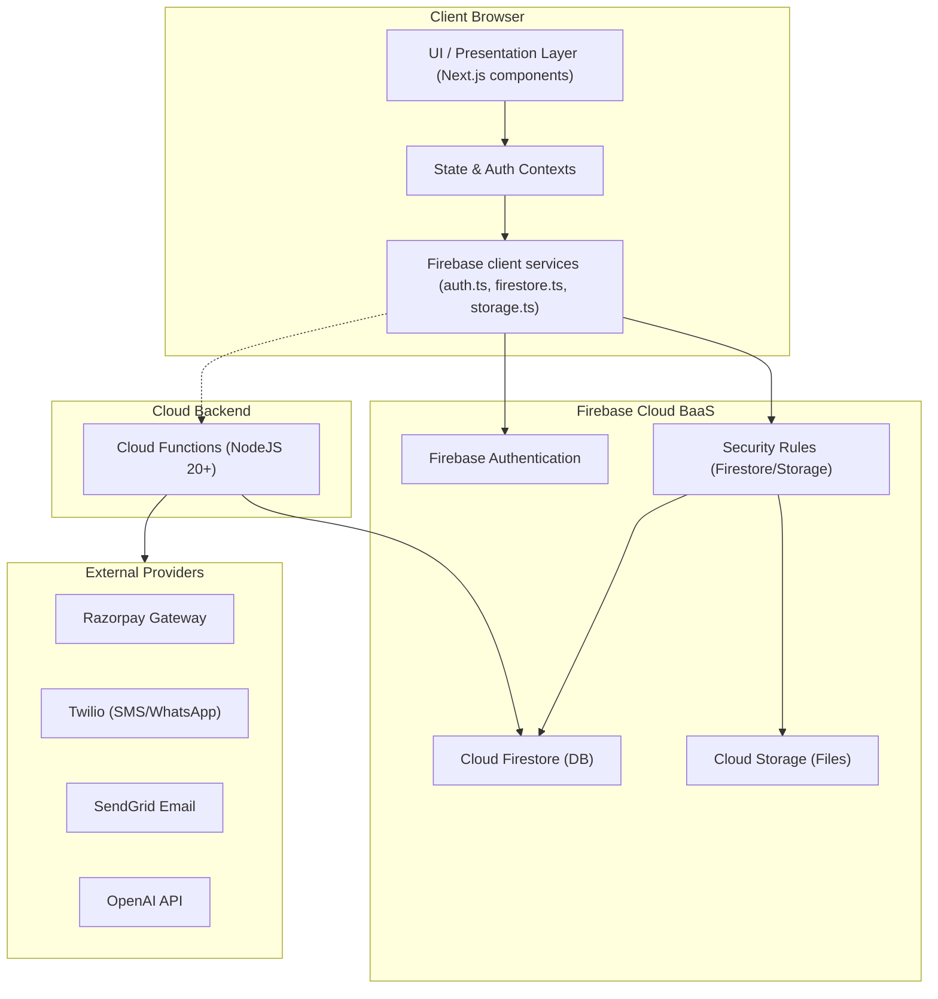
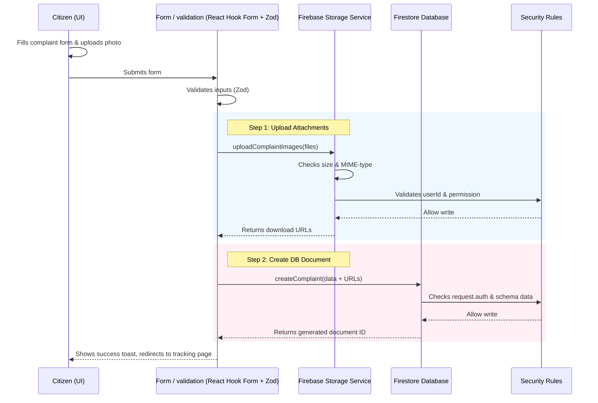

# Architecture

> Mapped: 2026-07-12

## High-Level Pattern

The Smart Municipal Citizen Portal (CSMC) is built as a serverless Single Page Application (SPA) using **Next.js 14 (App Router)** and **Firebase** as a Backend-as-a-Service (BaaS). It uses a hybrid architecture:
1. **Frontend / Presentation Layer:** React Client Components (`'use client'`) structured around Next.js App Router for rendering, state management (Zustand, React Context, React Query), and routing.
2. **Server/Cloud Interface:** Service modules (`src/lib/firebase/`) using the Firebase Web SDK to communicate directly with Firestore, Storage, and Auth.
3. **Admin/Cloud Backend (Serverless):** Firebase Cloud Functions in `functions/` for secure, server-side logic (e.g. integrations with payment gateways, SMS/email notifications, AI features) and Firebase Firestore security rules for role-based access control (RBAC).

---

## Architectural Layers

### 1. Presentation & Components Layer
- **Shells & Layouts:** Global layout (`src/app/layout.tsx`) sets up default fonts (Inter, Noto Sans Devanagari) and global styles. Route-specific UI shells (`src/components/pages/page-shell.tsx`) provide context-aware layout wrappers.
- **Atomic UI Components:** Located in `src/components/ui/` (e.g., `button.tsx`, `card.tsx`), these are styling wrappers built using Tailwind CSS.
- **Home/Public Components:** Specialized sections like `src/components/home/hero-section.tsx`, `about-section.tsx`, `online-services-section.tsx`.
- **Feature Pages:** Citizen-facing features (complaints, certificates, licenses, payments) and officer/admin dashboards reside in their respective pages.

### 2. State & Data Layer
- **Authentication Context:** `src/contexts/AuthContext.tsx` handles user lifecycle tracking. It uses Firebase `onAuthStateChanged` to populate the global user auth state and fetches corresponding custom profile fields from the `/users` Firestore collection via `getUserData` in `src/lib/firebase/auth.ts`.
- **Query & Mutation Caching:** TanStack Query (React Query) is declared in dependencies to fetch, cache, and synchronize server state.
- **Local Store:** Zustand is configured in dependencies for lightweight global store variables.

### 3. Service Layer (Client-Side Firebase wrapper)
Located in `src/lib/firebase/`:
- `config.ts`: Initialises and exposes singletons for App, Auth, Firestore Database, Storage, and Analytics.
- `auth.ts`: Implements user credentials operations (email/pass, Google, phone authentication) and user data syncing in Firestore.
- `firestore.ts`: Provides a generic CRUD interface over Firestore operations (`createDocument`, `getDocument`, etc.) alongside domain-specific Firestore functions (e.g. `createComplaint`, `getUserApplications`).
- `storage.ts`: Orchestrates file uploads to Cloud Storage with progress updates, MIME-type, and size validations.

### 4. Backend & Security Layer
- **Firestore & Storage Rules:** Decoupled security configuration files (`firestore.rules` and `storage.rules`) restrict read/write capabilities on Firestore collections and Storage prefixes. They check for user authentication, resource ownership, and target roles (`citizen`, `officer`, `admin`, `superadmin`).
- **Cloud Functions:** Serverless REST endpoints and triggers in `functions/` (Node.js runtime). Configured inside `firebase.json` for linting and pre-deployment building.

---

## Data Flow Diagram (e.g., Complaint Submission)

